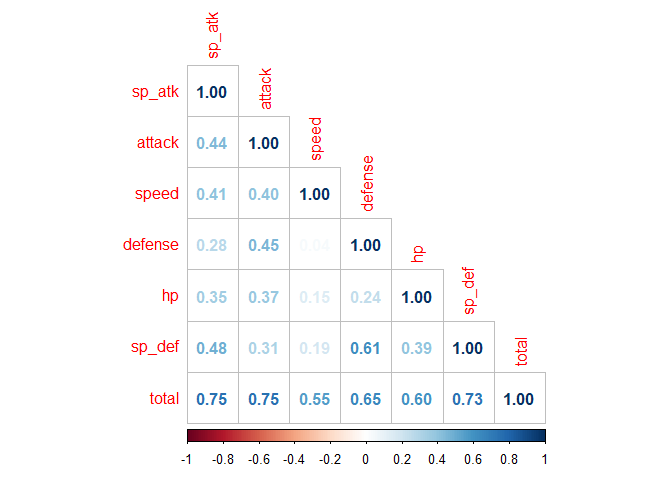
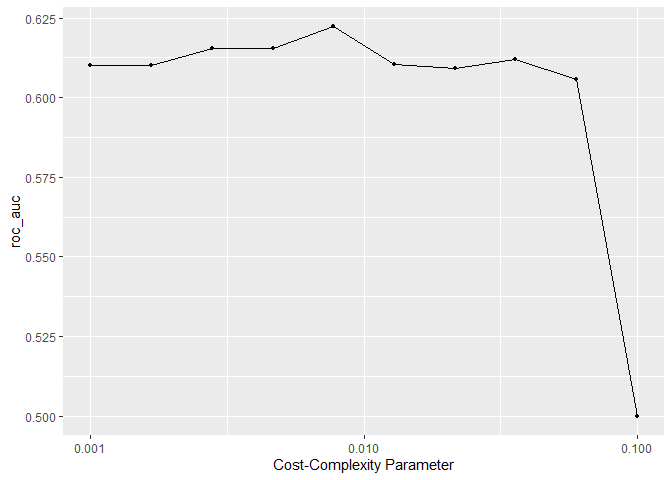
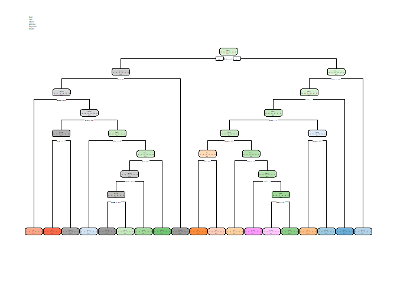

## Tree-Based Models

For this assignment, we will continue working with the file `"pokemon.csv"`, found in `/data`. The file is from Kaggle: <https://www.kaggle.com/abcsds/pokemon>.

The [Pokémon](https://www.pokemon.com/us/) franchise encompasses video games, TV shows, movies, books, and a card game. This data set was drawn from the video game series and contains statistics about 721 Pokémon, or "pocket monsters." In Pokémon games, the user plays as a trainer who collects, trades, and battles Pokémon to (a) collect all the Pokémon and (b) become the champion Pokémon trainer.

Each Pokémon has a [primary type](https://bulbapedia.bulbagarden.net/wiki/Type) (some even have secondary types). Based on their type, a Pokémon is strong against some types, and vulnerable to others. (Think rock, paper, scissors.) A Fire-type Pokémon, for example, is vulnerable to Water-type Pokémon, but strong against Grass-type.

{width="200"}

The goal of this assignment is to build a statistical learning model that can predict the **primary type** of a Pokémon based on its generation, legendary status, and six battle statistics.

**Note: Fitting ensemble tree-based models can take a little while to run. Consider running your models outside of the .Rmd, storing the results, and loading them in your .Rmd to minimize time to knit.**

### Exercise 1

Read in the data and set things up as in Homework 5:


- Use `clean_names()`

```r
Pokémon = clean_names(Pokémon)
```
- Filter out the rarer Pokémon types

```r
Pokémon = Pokémon[Pokémon$type_1 %in% c('Bug', 'Fire', 'Grass', 'Normal', 'Water', 'Psychic'),]
```
- Convert `type_1` and `legendary` to factors

```r
Pokémon$type_1 = as.factor(Pokémon$type_1)
Pokémon$legendary = as.factor(Pokémon$legendary)
Pokémon$generation = factor(Pokémon$generation)
```
Do an initial split of the data; you can choose the percentage for splitting. Stratify on the outcome variable.

```r
set.seed(91362)
Pokémon_split <- initial_split(Pokémon, prop = 0.70, strata = type_1)
Pokémon_train <- training(Pokémon_split)
Pokémon_test <- testing(Pokémon_split)
```
Fold the training set using *v*-fold cross-validation, with `v = 5`. Stratify on the outcome variable.

```r
set.seed(345)
Pokémon_folds <- vfold_cv(Pokémon_train, strata = type_1, v = 5)
```
Set up a recipe to predict `type_1` with `legendary`, `generation`, `sp_atk`, `attack`, `speed`, `defense`, `hp`, and `sp_def`:
- Dummy-code `legendary` and `generation`;
- Center and scale all predictors.

```r
Pokémon_train_recipe <- recipe(type_1 ~ legendary + generation + sp_atk + attack + speed + defense + hp + sp_def, data = Pokémon_train) %>% 
  step_normalize(all_numeric_predictors())
```

### Exercise 2

Create a correlation matrix of the training set, using the `corrplot` package. *Note: You can choose how to handle the continuous variables for this plot; justify your decision(s).*

```r
Pokémon_train %>%
  select(sp_atk, attack, speed, defense, hp, sp_def, total) %>% 
  cor() %>% 
  corrplot(type = 'lower', diag = TRUE, method = 'number')
```

<!-- -->
What relationships, if any, do you notice? Do these relationships make sense to you?

Answer:
I deciding to exclude generation, number, type_2, and legendary because each of them were either a factor, or completely uncorrelated to any other predictor. I am not surprised at all that total has a strong positive correlation with all other predictors since total is the sum of all of them and is therefore dependent upon them. Other than that, the rest of the predictors have moderate positive correlation with each other. The only exception is speed, which does not have any significant correlation with any of the other predictors. That makes sense because speed is not very closely related to thing such as hp, attack, or defense due to pokemon having a variety of body types which invalidates the otherwise conventional notion of speed being something that is sacrificed for defense.

### Exercise 3

First, set up a decision tree model and workflow. Tune the `cost_complexity` hyperparameter. Use the same levels we used in Lab 7 -- that is, `range = c(-3, -1)`. Specify that the metric we want to optimize is `roc_auc`. 

```r
tree_spec <- decision_tree() %>%
  set_engine("rpart")

class_tree_spec <- tree_spec %>%
  set_mode("classification")

class_tree_wf <- workflow() %>%
  add_model(class_tree_spec %>% set_args(cost_complexity = tune())) %>%
  add_recipe(Pokémon_train_recipe)

param_grid <-grid_regular(cost_complexity(range = c(-3, -1)), levels = 10)

tune_res <- tune_grid(
  class_tree_wf, 
  resamples = Pokémon_folds, 
  grid = param_grid, 
  metrics = metric_set(roc_auc),
  control = control_grid(verbose = TRUE)
  )

autoplot(tune_res)
```

<!-- -->
Print an `autoplot()` of the results. What do you observe? Does a single decision tree perform better with a smaller or larger complexity penalty?

Answer:
A single decision tree performs better with a smaller complexity penalty. From 0.001 to around 0.017, the cost-complexity has a similar `roc_auc`, but it sharply declines after that point.

### Exercise 4

What is the `roc_auc` of your best-performing pruned decision tree on the folds? *Hint: Use `collect_metrics()` and `arrange()`.*

```r
arrange(collect_metrics(tune_res), desc(mean))
```

```
## # A tibble: 10 × 7
##    cost_complexity .metric .estimator  mean     n std_err .config              
##              <dbl> <chr>   <chr>      <dbl> <int>   <dbl> <chr>                
##  1         0.00774 roc_auc hand_till  0.612     5  0.0229 Preprocessor1_Model05
##  2         0.0359  roc_auc hand_till  0.612     5  0.0182 Preprocessor1_Model08
##  3         0.0215  roc_auc hand_till  0.609     5  0.0230 Preprocessor1_Model07
##  4         0.0129  roc_auc hand_till  0.607     5  0.0207 Preprocessor1_Model06
##  5         0.0599  roc_auc hand_till  0.606     5  0.0164 Preprocessor1_Model09
##  6         0.00278 roc_auc hand_till  0.603     5  0.0250 Preprocessor1_Model03
##  7         0.00464 roc_auc hand_till  0.603     5  0.0250 Preprocessor1_Model04
##  8         0.001   roc_auc hand_till  0.598     5  0.0242 Preprocessor1_Model01
##  9         0.00167 roc_auc hand_till  0.598     5  0.0242 Preprocessor1_Model02
## 10         0.1     roc_auc hand_till  0.5       5  0      Preprocessor1_Model10
```

```r
best_complexity <- select_best(tune_res)
best_complexity
```

```
## # A tibble: 1 × 2
##   cost_complexity .config              
##             <dbl> <chr>                
## 1         0.00774 Preprocessor1_Model05
```

### Exercise 5

Using `rpart.plot`, fit and visualize your best-performing pruned decision tree with the *training* set.

```r
class_tree_final <- finalize_workflow(class_tree_wf, best_complexity)

class_tree_final_fit <- fit(class_tree_final, data = Pokémon_train)

class_tree_final_fit %>%
  extract_fit_engine() %>%
  rpart.plot(fallen.leaves = FALSE)
```

<!-- -->

### Exercise 6

Now set up a random forest model and workflow. Use the `ranger` engine and set `importance = "impurity"`. Tune `mtry`, `trees`, and `min_n`. Using the documentation for `rand_forest()`, explain in your own words what each of these hyperparameters represent.

```r
library(randomForest)

rf_spec <- rand_forest(mtry = tune(), trees = tune(), min_n = tune()) %>%
  set_engine("ranger", importance = "impurity") %>%
  set_mode("classification")

rf_wkflow <- workflow() %>%
  add_model(rf_spec) %>%
  add_recipe(Pokémon_train_recipe)
```

Create a regular grid with 8 levels each. You can choose plausible ranges for each hyperparameter. Note that `mtry` should not be smaller than 1 or larger than 8. **Explain why not. What type of model would `mtry = 8` represent?**

```r
tune_grid <- grid_regular(mtry(range = c(1, 8)), trees(range = c(1,500)), min_n(range = c(1,8)), levels = 8)
```

### Exercise 7

Specify `roc_auc` as a metric. Tune the model and print an `autoplot()` of the results. What do you observe? What values of the hyperparameters seem to yield the best performance?


### Exercise 8

What is the `roc_auc` of your best-performing random forest model on the folds? *Hint: Use `collect_metrics()` and `arrange()`.*


### Exercise 8

Create a variable importance plot, using `vip()`, with your best-performing random forest model fit on the *training* set.

Which variables were most useful? Which were least useful? Are these results what you expected, or not?

Answer:
The most useful variable is `sp_atk`, while the least useful variables were `generation` and `legendary`. I would expect this outcome because the `legendary` only applies to a small fraction of all Pokemon and generation does not have any effect on the other variables.

### Exercise 9

Finally, set up a boosted tree model and workflow. Use the `xgboost` engine. Tune `trees`. Create a regular grid with 10 levels; let `trees` range from 10 to 2000. Specify `roc_auc` and again print an `autoplot()` of the results. 


What do you observe?

What is the `roc_auc` of your best-performing boosted tree model on the folds? *Hint: Use `collect_metrics()` and `arrange()`.*

### Exercise 10

Display a table of the three ROC AUC values for your best-performing pruned tree, random forest, and boosted tree models. Which performed best on the folds? Select the best of the three and use `select_best()`, `finalize_workflow()`, and `fit()` to fit it to the *testing* set. 

Print the AUC value of your best-performing model on the testing set. Print the ROC curves. Finally, create and visualize a confusion matrix heat map.

Which classes was your model most accurate at predicting? Which was it worst at?

## For 231 Students

### Exercise 11

Using the `abalone.txt` data from previous assignments, fit and tune a random forest model to predict `age`. Use stratified cross-validation and select ranges for `mtry`, `min_n`, and `trees`. Present your results. What was the model's RMSE on your testing set?
