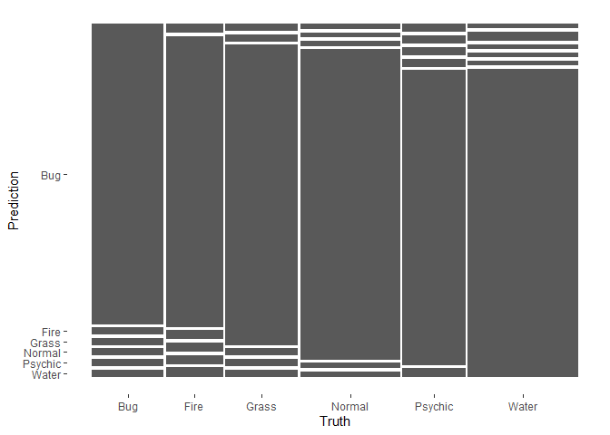

## Tree-Based Models

For this assignment, we will continue working with the file `"pokemon.csv"`, found in `/data`. The file is from Kaggle: <https://www.kaggle.com/abcsds/pokemon>.

The [Pokémon](https://www.pokemon.com/us/) franchise encompasses video games, TV shows, movies, books, and a card game. This data set was drawn from the video game series and contains statistics about 721 Pokémon, or "pocket monsters." In Pokémon games, the user plays as a trainer who collects, trades, and battles Pokémon to (a) collect all the Pokémon and (b) become the champion Pokémon trainer.

Each Pokémon has a [primary type](https://bulbapedia.bulbagarden.net/wiki/Type) (some even have secondary types). Based on their type, a Pokémon is strong against some types, and vulnerable to others. (Think rock, paper, scissors.) A Fire-type Pokémon, for example, is vulnerable to Water-type Pokémon, but strong against Grass-type.

{width="200"}

The goal of this assignment is to build a statistical learning model that can predict the **primary type** of a Pokémon based on its generation, legendary status, and six battle statistics.

**Note: Fitting ensemble tree-based models can take a little while to run. Consider running your models outside of the .Rmd, storing the results, and loading them in your .Rmd to minimize time to knit.**

### Exercise 1

Read in the data and set things up as in Homework 5:


- Use `clean_names()`

```r
Pokémon = clean_names(Pokémon)
```
- Filter out the rarer Pokémon types

```r
Pokémon = Pokémon[Pokémon$type_1 %in% c('Bug', 'Fire', 'Grass', 'Normal', 'Water', 'Psychic'),]
```
- Convert `type_1` and `legendary` to factors

```r
Pokémon$type_1 = as.factor(Pokémon$type_1)
Pokémon$legendary = as.factor(Pokémon$legendary)
Pokémon$generation = factor(Pokémon$generation)
```
Do an initial split of the data; you can choose the percentage for splitting. Stratify on the outcome variable.

```r
set.seed(91362)
Pokémon_split <- initial_split(Pokémon, prop = 0.70, strata = type_1)
Pokémon_train <- training(Pokémon_split)
Pokémon_test <- testing(Pokémon_split)
```
Fold the training set using *v*-fold cross-validation, with `v = 5`. Stratify on the outcome variable.

```r
set.seed(345)
Pokémon_folds <- vfold_cv(Pokémon_train, strata = type_1, v = 5)
```
Set up a recipe to predict `type_1` with `legendary`, `generation`, `sp_atk`, `attack`, `speed`, `defense`, `hp`, and `sp_def`:
- Dummy-code `legendary` and `generation`;
- Center and scale all predictors.

```r
Pokémon_train_recipe <- recipe(type_1 ~ legendary + generation + sp_atk + attack + speed + defense + hp + sp_def, data = Pokémon_train) %>% 
  step_dummy(all_nominal_predictors()) %>%
  step_normalize(all_numeric_predictors())
```

### Exercise 2

Create a correlation matrix of the training set, using the `corrplot` package. *Note: You can choose how to handle the continuous variables for this plot; justify your decision(s).*

```r
Pokémon_train %>%
  select(sp_atk, attack, speed, defense, hp, sp_def, total) %>% 
  cor() %>% 
  corrplot(type = 'lower', diag = TRUE, method = 'number')
```

<!-- -->
What relationships, if any, do you notice? Do these relationships make sense to you?

Answer:
I decided to exclude generation, number, type_2, and legendary because each of them were either a factor, or completely uncorrelated to any other predictor. I am not surprised at all that total has a strong positive correlation with all other predictors since total is the sum of all of them and is therefore dependent upon them. Other than that, the rest of the predictors have moderate positive correlation with each other. The only exception is speed, which does not have any significant correlation with any of the other predictors. That makes sense because speed is not very closely related to thing such as hp, attack, or defense due to pokemon having a variety of body types which invalidates the otherwise conventional notion of speed being something that is sacrificed for defense.

### Exercise 3

First, set up a decision tree model and workflow. Tune the `cost_complexity` hyperparameter. Use the same levels we used in Lab 7 -- that is, `range = c(-3, -1)`. Specify that the metric we want to optimize is `roc_auc`. 

```r
tree_spec <- decision_tree() %>%
  set_engine("rpart")

class_tree_spec <- tree_spec %>%
  set_mode("classification")

class_tree_wf <- workflow() %>%
  add_model(class_tree_spec %>% set_args(cost_complexity = tune())) %>%
  add_recipe(Pokémon_train_recipe)

param_grid <-grid_regular(cost_complexity(range = c(-3, -1)), levels = 10)

tune_res <- tune_grid(
  class_tree_wf, 
  resamples = Pokémon_folds, 
  grid = param_grid, 
  metrics = metric_set(roc_auc),
  control = control_grid(verbose = TRUE)
  )

autoplot(tune_res)
```

<!-- -->
Print an `autoplot()` of the results. What do you observe? Does a single decision tree perform better with a smaller or larger complexity penalty?

Answer:
A single decision tree performs better with a smaller complexity penalty. From 0.001 to around 0.017, the cost-complexity has a similar `roc_auc`, but it sharply declines after that point.

### Exercise 4

What is the `roc_auc` of your best-performing pruned decision tree on the folds? *Hint: Use `collect_metrics()` and `arrange()`.*

```r
complexity <- arrange(collect_metrics(tune_res), desc(mean))
best_complexity <- complexity[1,]
best_complexity
```

```
## # A tibble: 1 × 7
##   cost_complexity .metric .estimator  mean     n std_err .config              
##             <dbl> <chr>   <chr>      <dbl> <int>   <dbl> <chr>                
## 1         0.00774 roc_auc hand_till  0.622     5  0.0160 Preprocessor1_Model05
```

### Exercise 5

Using `rpart.plot`, fit and visualize your best-performing pruned decision tree with the *training* set.

```r
class_tree_final <- finalize_workflow(class_tree_wf, best_complexity)

class_tree_final_fit <- fit(class_tree_final, data = Pokémon_train)

class_tree_final_fit %>%
  extract_fit_engine() %>%
  rpart.plot()
```

<!-- -->

### Exercise 6

Now set up a random forest model and workflow. Use the `ranger` engine and set `importance = "impurity"`. Tune `mtry`, `trees`, and `min_n`. Using the documentation for `rand_forest()`, explain in your own words what each of these hyperparameters represent.


Create a regular grid with 8 levels each. You can choose plausible ranges for each hyperparameter.

```r
tune_grid <- grid_regular(mtry(range = c(1, 8)), trees(range = c(1,500)), min_n(range = c(1,8)), levels = 8)
```
Note that `mtry` should not be smaller than 1 or larger than 8. **Explain why not. What type of model would `mtry = 8` represent?**
Answer: 
`mtry` is the number of random variables sampled. You can't sample 0 variables and you can't sample more variables than you have in the recipe. mtry = 8 would represent all of the variabled being used in the sampling.

### Exercise 7

Specify `roc_auc` as a metric. Tune the model and print an `autoplot()` of the results. What do you observe? What values of the hyperparameters seem to yield the best performance?

```r
tune_res2 <- tune_grid(
  object = rf_wkflow, 
  resamples = Pokémon_folds,
  grid = tune_grid,
  metrics = metric_set(roc_auc),
  control = control_grid(verbose = TRUE))

autoplot(tune_res2)
```
{width="3000", height="3000"}


### Exercise 8

What is the `roc_auc` of your best-performing random forest model on the folds? *Hint: Use `collect_metrics()` and `arrange()`.*


```r
best_rf <- rf_metrics[1,]
best_rf
```

```
## # A tibble: 1 × 9
##    mtry trees min_n .metric .estimator  mean     n std_err .config              
##   <dbl> <dbl> <dbl> <chr>   <chr>      <dbl> <dbl>   <dbl> <chr>                
## 1     4   143     4 roc_auc hand_till  0.734     5  0.0107 Preprocessor1_Model2…
```

### Exercise 9

Create a variable importance plot, using `vip()`, with your best-performing random forest model fit on the *training* set.

Which variables were most useful? Which were least useful? Are these results what you expected, or not?

```r
rf_final <- finalize_workflow(rf_wkflow, best_rf)

rf_final_fit <- fit(rf_final, data = Pokémon_train)

rf_final_fit %>%
  pull_workflow_fit() %>%
  vip()
```

<!-- -->
Answer:
The most useful variable is `sp_atk`, while the least useful variables were `generation` and `legendary`, the later of which seems to be absent from the plot as I expected due to it only applying to a small fraction of all Pokemon while the former does not have any noticeable effect on the other variables.

### Exercise 10

Finally, set up a boosted tree model and workflow. Use the `xgboost` engine. Tune `trees`. Create a regular grid with 10 levels; let `trees` range from 10 to 2000. Specify `roc_auc` and again print an `autoplot()` of the results. 

```r
library(xgboost)

boost_spec <- boost_tree(trees = tune())%>%
  set_engine("xgboost") %>%
  set_mode("classification")

boost_wkflow <- workflow() %>%
  add_model(boost_spec) %>%
  add_recipe(Pokémon_train_recipe)

boost_grid <- grid_regular(trees(range=c(10, 2000)), levels = 10)
```

```r
boost_res <- tune_grid(
  object = boost_wkflow,
  resamples = Pokémon_folds,
  grid = boost_grid,
  metrics = metric_set(roc_auc),
  control = control_grid(verbose = TRUE))
```


What do you observe?

What is the `roc_auc` of your best-performing boosted tree model on the folds? *Hint: Use `collect_metrics()` and `arrange()`.*

```r
best_boost <- boost_metrics[1,]
best_boost
```

```
## # A tibble: 1 × 7
##   trees .metric .estimator  mean     n std_err .config              
##   <dbl> <chr>   <chr>      <dbl> <dbl>   <dbl> <chr>                
## 1  1115 roc_auc hand_till  0.708     5  0.0169 Preprocessor1_Model06
```

### Exercise 11

Display a table of the three ROC AUC values for your best-performing pruned tree, random forest, and boosted tree models. Which performed best on the folds? Select the best of the three and use `select_best()`, `finalize_workflow()`, and `fit()` to fit it to the *testing* set. 

```r
all_best <- rbind(best_complexity[2:7], best_rf[4:9], best_boost[2:7])

all_best <- data.frame(all_best)

Method <- c("Pruned tree", "Random forest", "Boosted tree")

all_best['Method'] <- Method

all_best
```

```
##   .metric .estimator      mean n    std_err                .config
## 1 roc_auc  hand_till 0.6222688 5 0.01601021  Preprocessor1_Model05
## 2 roc_auc  hand_till 0.7336462 5 0.01072295 Preprocessor1_Model212
## 3 roc_auc  hand_till 0.7076463 5 0.01688014  Preprocessor1_Model06
##          Method
## 1   Pruned tree
## 2 Random forest
## 3  Boosted tree
```

```r
absolute_best = arrange(all_best, desc(mean))[1,]
absolute_best
```

```
##   .metric .estimator      mean n    std_err                .config
## 1 roc_auc  hand_till 0.7336462 5 0.01072295 Preprocessor1_Model212
##          Method
## 1 Random forest
```


```r
best_final <- finalize_workflow(rf_wkflow, best_rf)

best_final_fit <- fit(best_final, data = Pokémon_test)
```

Print the AUC value of your best-performing model on the testing set. Print the ROC curves. Finally, create and visualize a confusion matrix heat map.


```r
augment(best_final_fit, new_data = Pokémon_test, metric = 'roc_auc')
```

```
## # A tibble: 140 × 20
##    number name      type_1 type_2 total    hp attack defense sp_atk sp_def speed
##     <dbl> <chr>     <fct>  <chr>  <dbl> <dbl>  <dbl>   <dbl>  <dbl>  <dbl> <dbl>
##  1      3 Venusaur… Grass  Poison   625    80    100     123    122    120    80
##  2      6 Charizar… Fire   Flying   634    78    104      78    159    115   100
##  3      7 Squirtle  Water  <NA>     314    44     48      65     50     64    43
##  4      9 Blastoise Water  <NA>     530    79     83     100     85    105    78
##  5     12 Butterfr… Bug    Flying   395    60     45      50     90     80    70
##  6     14 Kakuna    Bug    Poison   205    45     25      50     25     25    35
##  7     15 Beedrill  Bug    Poison   395    65     90      40     45     80    75
##  8     15 Beedrill… Bug    Poison   495    65    150      40     15     80   145
##  9     18 Pidgeot   Normal Flying   479    83     80      75     70     70   101
## 10     18 PidgeotM… Normal Flying   579    83     80      80    135     80   121
## # … with 130 more rows, and 9 more variables: generation <fct>,
## #   legendary <fct>, .pred_class <fct>, .pred_Bug <dbl>, .pred_Fire <dbl>,
## #   .pred_Grass <dbl>, .pred_Normal <dbl>, .pred_Psychic <dbl>,
## #   .pred_Water <dbl>
```

```r
augment(best_final_fit, new_data = Pokémon_test) %>%
  roc_auc(truth = type_1, estimate = c(.pred_Fire, .pred_Bug, .pred_Grass, .pred_Normal, .pred_Water, .pred_Psychic))
```

```
## # A tibble: 1 × 3
##   .metric .estimator .estimate
##   <chr>   <chr>          <dbl>
## 1 roc_auc hand_till      0.563
```

```r
augment(best_final_fit, new_data = Pokémon_test) %>%
  roc_curve(truth = type_1, estimate = c(.pred_Fire, .pred_Bug, .pred_Grass, .pred_Normal, .pred_Water, .pred_Psychic)) %>%
  autoplot()
```

<!-- -->

```r
augment(best_final_fit, new_data = Pokémon_test) %>%
  conf_mat(truth = type_1, estimate = .pred_class)
```

```
##           Truth
## Prediction Bug Fire Grass Normal Psychic Water
##    Bug      21    0     0      0       0     0
##    Fire      0   16     0      0       0     1
##    Grass     0    0    21      0       0     0
##    Normal    0    0     0     30       0     0
##    Psychic   0    0     0      0      18     0
##    Water     0    0     0      0       0    33
```

```r
augment(best_final_fit, new_data = Pokémon_test) %>%
  conf_mat(truth = type_1, estimate = .pred_class) %>%
  autoplot()
```

<!-- -->
Which classes was your model most accurate at predicting? Which was it worst at?
Answer:
It was most accurate at predicting normal types and least accurate predicting water types.

## For 231 Students

### Exercise 12

Using the `abalone.txt` data from previous assignments, fit and tune a random forest model to predict `age`. Use stratified cross-validation and select ranges for `mtry`, `min_n`, and `trees`. Present your results. What was the model's RMSE on your testing set?

```r
abalone <- read_csv("abalone.csv")

abalone['age'] = abalone['rings'] + 1.5
```

```r
set.seed(91362)
abalone_split <- initial_split(abalone, prop = 0.80, strata = 'age')
abalone_train <- training(abalone_split)
abalone_test <- testing(abalone_split)

set.seed(345)
abalone_folds <- vfold_cv(abalone_train, strata = age, v = 5)

abalone_recipe <- recipe(age ~ type + longest_shell + diameter + height + whole_weight + shucked_weight + viscera_weight + shell_weight, data = abalone_train) %>%
  step_dummy(all_nominal_predictors()) %>% 
  step_interact(terms = ~ shucked_weight:shell_weight) %>% 
  step_interact(terms = ~ starts_with('type'):shucked_weight) %>%
  step_interact(terms = ~longest_shell:diameter) %>%
  step_normalize(all_predictors())

library(randomForest)

abalone_spec <- rand_forest(mtry = tune(), trees = tune(), min_n = tune()) %>%
  set_engine("ranger", importance = "impurity") %>%
  set_mode("regression")

abalone_wkflow <- workflow() %>%
  add_model(abalone_spec) %>%
  add_recipe(abalone_recipe)

abalone_grid <- grid_regular(mtry(range = c(1, 8)), trees(range = c(1,500)), min_n(range = c(1,8)), levels = 5)
```

```r
abalone_res <- tune_grid(
  object = abalone_wkflow, 
  resamples = abalone_folds,
  grid = abalone_grid,
  metrics = metric_set(rmse),
  control = control_grid(verbose = TRUE))

autoplot(abalone_res)
```
{width="3000", height="3000"}

```r
abalone_metrics <- read_csv("abalone_metrics.csv")

best_abalone <- abalone_metrics[1,]

best_abalone
```

```
## # A tibble: 1 × 9
##    mtry trees min_n .metric .estimator  mean     n std_err .config              
##   <dbl> <dbl> <dbl> <chr>   <chr>      <dbl> <dbl>   <dbl> <chr>                
## 1     4     1     1 rmse    standard    3.11     5  0.0791 Preprocessor1_Model0…
```

```r
abalone_final <- finalize_workflow(abalone_wkflow, best_abalone)

abalone_final_fit <- fit(abalone_final, data = abalone_train)

augment(abalone_final_fit, new_data = abalone_test, metric = 'rmse')
```

```
## # A tibble: 837 × 11
##    type  longest_shell diameter height whole_weight shucked_weight
##    <chr>         <dbl>    <dbl>  <dbl>        <dbl>          <dbl>
##  1 F             0.545    0.425  0.125        0.768          0.294
##  2 M             0.43     0.35   0.11         0.406          0.168
##  3 M             0.5      0.4    0.13         0.664          0.258
##  4 F             0.56     0.44   0.14         0.928          0.382
##  5 M             0.58     0.47   0.165        0.998          0.394
##  6 F             0.68     0.55   0.175        1.80           0.815
##  7 F             0.54     0.475  0.155        1.22           0.530
##  8 M             0.355    0.29   0.09         0.328          0.134
##  9 F             0.45     0.335  0.105        0.425          0.186
## 10 F             0.55     0.425  0.135        0.852          0.362
## # … with 827 more rows, and 5 more variables: viscera_weight <dbl>,
## #   shell_weight <dbl>, rings <dbl>, age <dbl>, .pred <dbl>
```

```r
augment(abalone_final_fit, new_data = abalone_test) %>%
  rmse(truth = age, estimate = .pred)
```

```
## # A tibble: 1 × 3
##   .metric .estimator .estimate
##   <chr>   <chr>          <dbl>
## 1 rmse    standard        3.05
```
